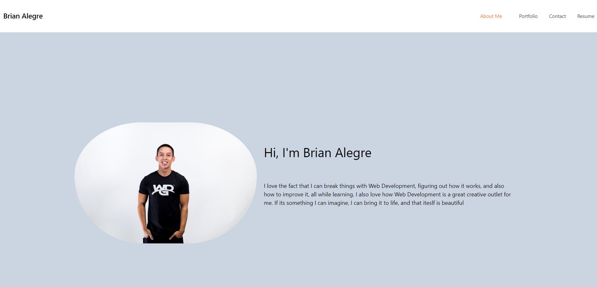

# 20-React-Portfolio

## Table of Contents 📑
- [Description](#description)
- [Application Preview](#application-preview)
- [Links](#links)
- [Criteria](#criteria)
- [Technologies](#technologies)
- [Questions](#questions)
- [License](#license)

## Description
Creating portfolio using my new React skills

## Application Preview

    

## Links
-   Github Repository:
    - https://github.com/brianalegre/20-React-Portfolio
-   Github Deployed:
    - https://brianalegre.github.io/20-React-Portfolio/

## Criteria
- Use `gh-pages` branch to host the deployed application
- Single Page application
    - Header
        - Developer's Name
        - Navbar
    - Section for content
    - Footer
- On First Load - About Me Section shown by default
- 6 Applications shown
    - Deployed, and Repo Links
- Contact Section
    - Form - name, email, and message
    - Cursor - Notification if cursor is removed not hover required field and unfilledd
    - Validation for email
- Resume Section
    - Downloadable resume
- Footer Section
    - Icons\Links - Github, LindedIn, Third Platform Profile, Email/Phone

- Create-react-app, Components
    - Header
    - Navbar
    - Projects
    - Footer

## Technologies
- React 
- Framer Motion
- React Icons
- Tailwind
- Flowbite

## Questions
Questions? Concerns?  Contact Me Below:
- Github Username: brianalegre
- Github Link: https://github.com/brianalegre 
- Email: brialegre@yahoo.com

## License
- Copyright 2022 Brian Alegre
- Licensed under the: [MIT License](https://opensource.org/licenses/MIT) 

